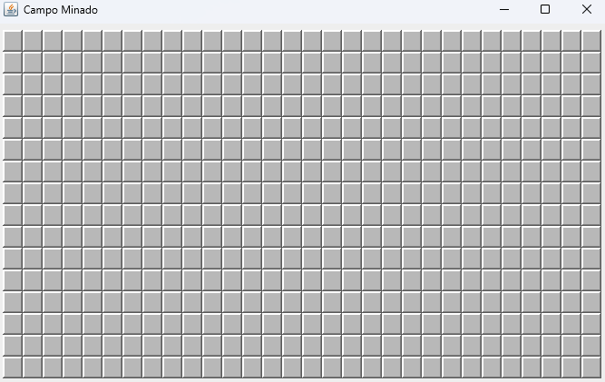
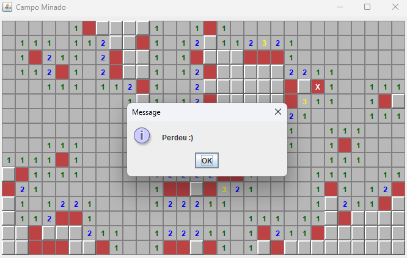

# Campo-Minado-Swing

Simples campo minado desenvolvido durante curso de Java da Cod3r Cursos, com o objetivo de aprender os básicos da API de interfaces gráfica Swing.

## Aprendizados

- Logica básica de gerenciamento e criação de interfaces atráves da API Swing.
- Básico do Framework JUnit, como desenvolver e realizar teste.
## Bibliotecas utilizadas

- Java Swing: [https://docs.oracle.com/javase/tutorial/uiswing/](https://docs.oracle.com/javase/tutorial/uiswing/)
- JUnit 5: [https://junit.org/junit5/](https://junit.org/junit5/)
- Maven: [https://maven.apache.org/](https://maven.apache.org/)
## Screenshots

## Autores

- [@ViictorP](https://www.github.com/ViictorP)

## Licença

